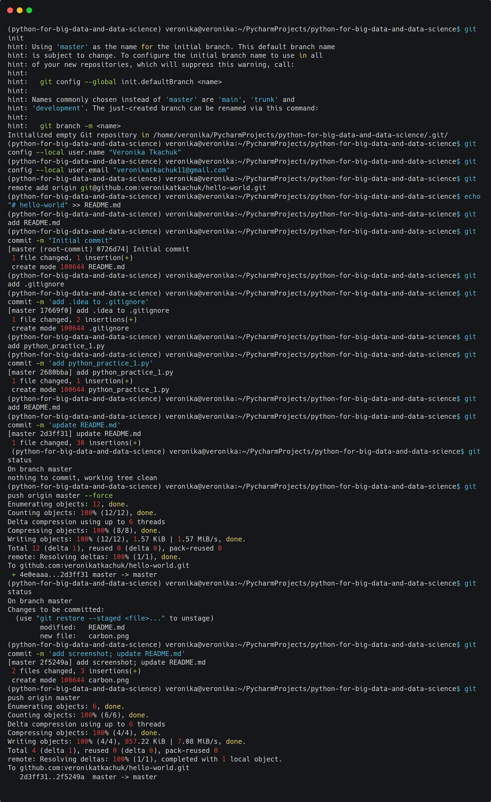

# hello-world

## Description
Simple project

## Commands used during development process

```bash
python --version
git --version

git init
git config --global user.name "Veronika Tkachuk"
git config --global user.email "veronikatkachuk11@gmail.com"
git remote add origin git@github.com:veronikatkachuk/hello-world.git
echo "# hello-world" >> README.md
git add .
git commit -m "Initial commit"
git status
git add .gitignore
git commit -m 'add .idea to .gitignore'
git push -u origin master
git add README.md
git commit -m 'update README.md'
git push origin master
...
```
Screenshot:


To push changes to GitHub repository I used SSH (officialy recommended way).
That's why additional steps were generating and adding SSH keys folowing these instructions:
[Generating a new SSH key and adding it to the ssh-agent](https://docs.github.com/en/authentication/connecting-to-github-with-ssh/generating-a-new-ssh-key-and-adding-it-to-the-ssh-agent)
[Adding a new SSH key to your GitHub account](https://docs.github.com/en/authentication/connecting-to-github-with-ssh/adding-a-new-ssh-key-to-your-github-account)